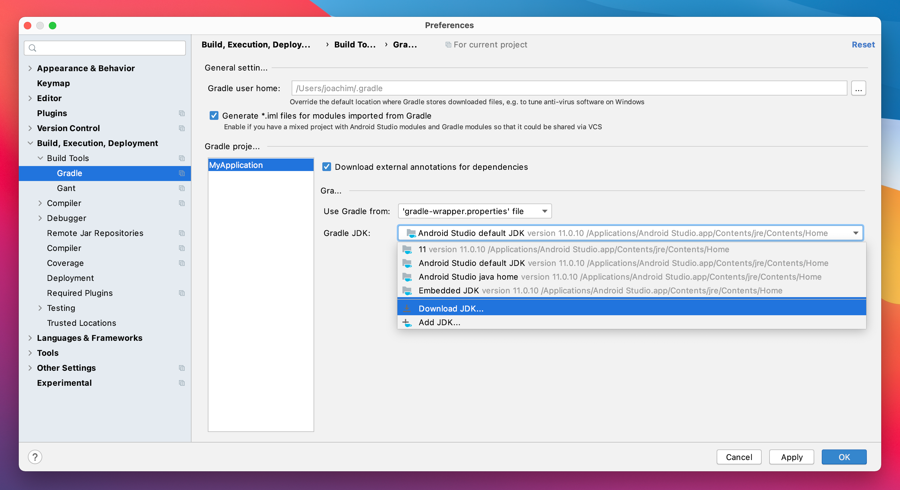
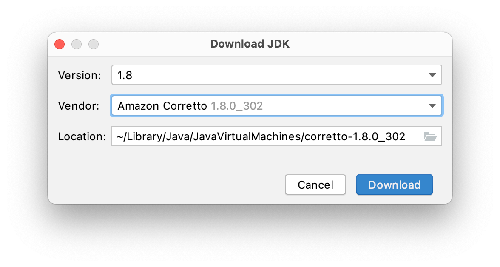
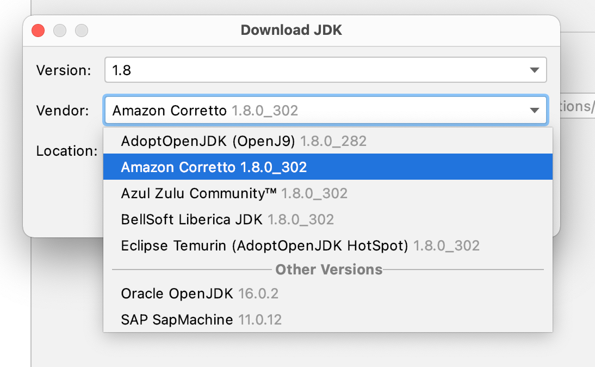
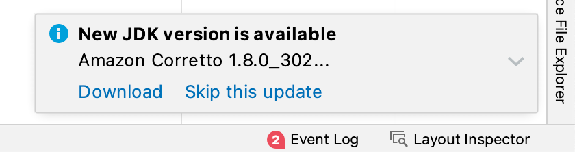

Updating Android Studio is always some 'exciting' event - what changes and will it break my current setup.
Some changes in 4.2 made me imediatelly rollback to 4.1.3.
Android Studio 2020.3.1 Arctic Fox got a new chance and I'm really plessantly surprised!

A [small feature already introduced in 4.2](https://developer.android.com/studio/releases#4.2-bundled-jdk-11) is the ability to manage installed JDKs from Android Studio.
Till 4.2 you might not bother setting some JDK / JAVA_HOME stuff at all - Android Studio used the bundled JDK 8.

Having to deal with e.g. custom cacerts in your JDK security folder - you might got a [little frustrated](https://stackoverflow.com/questions/51373608/some-conflicts-were-found-in-the-installation-area-android-studio-cacerts-er) about the Android Studio updating process.

Handling JDK(s) separately from the Android Studio embedded was already possible, but a little knowledge, tools (like [SDKMAN!](https://sdkman.io/jdks)) or [tutorials](https://mkyong.com/java/how-to-install-java-on-mac-osx) are necessary.

**Update 19.12.2021:** Using [brew](https://brew.sh) to install and manage updates is common, so this could also be an interesting alternative for installing multiple JDKs. Jake mentioned a good alternative to the standard JDK source.

<blockquote class="twitter-tweet">
Finally switched from the (now defunct) Adopt JDKs to the historically excellent Azul Zulu ones.  $ brew list -1 | grep adopt | xargs brew uninstall $ brew tap mdogan/zulu $ brew install --cask zulu-jdk17 zulu-jdk16 zulu-jdk11 zulu-jdk8
&mdash; Jake Wharton (@JakeWharton) <a href="https://twitter.com/JakeWharton/status/1463524757765251082?ref_src=twsrc%5Etfw">November 24, 2021</a></blockquote> 

I still prefer the new integration via Android Studio - it installs the JDKs into the users `~/Library/Java/JavaVirtualMachines` directory - I like it better than the global installation, but it's a matter of taste. Also, Android Studio notifies me of version updates - if you use brew frequently, this may not be an argument for you.

See [my post manage multiple Java JDK versions]({{ site.baseurl }}) to switch between JDK versions.

## Integrated Preference for Gradle JDK management

But now there is a nice JDK configuration integrated in the Android Studio preferences.

Open **Preferences...**, navigate to **Build, Execution, Deployment** > **Build Tools** > **Gradle**

In the menu **Grade JDK:** you can see the currently selected JDK for the current project. From this menu you can select the other JDKs found. Or you can Download a new one with **Download JDK...**.

Form the dialog you can select your **Version** and your **Vendor** and the **Location** to install the JDK to.

With the separate Installation of the JDK customizations in that instance will not affect your Android Studio bundled JDK.

Another benefit is that Android Studio will notify you on updates to the installed JDK.

