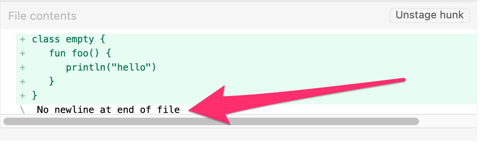
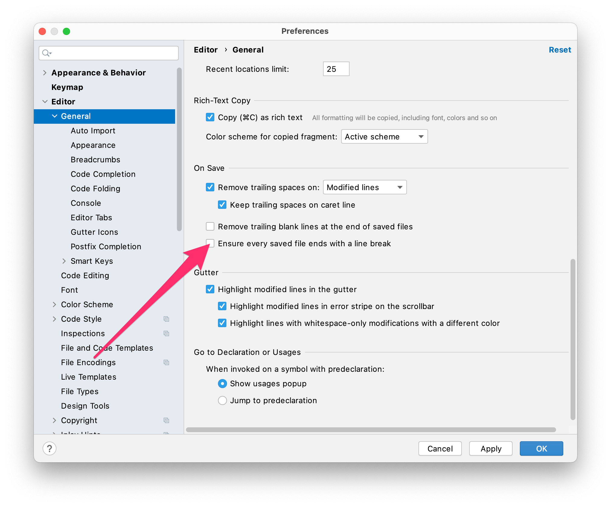

Ever wondered why most diff tools and git clients complain a missing newline at the end of the file?




You may also have ignored it and just commited anyway and thats ok.

But why does some tools complain if there is 'nothing wrong'?

The issue is that a 'line' in a text file is [defined by the POSIX standard](https://pubs.opengroup.org/onlinepubs/9699919799/basedefs/V1_chap03.html#tag_03_206) as

> **3.206 Line**
>
> A sequence of zero or more non-\<newline\> characters plus a terminating \<newline\> character.

This means a file that has no terminating `<newline>` aka. `'\n'` in the last line may confuse tools which handle files strict on the POSIX definition.

[This answer on stackoverflow](https://stackoverflow.com/a/729795/362182) explains it very detailed. And in the comments you can see some tough discussions about the pros and cons of this POSIX `<newline>` implication - whatever that is supposed to help.

## Relief to that complaining

The only way to silence the tools is to insert a `<newline>` at the end of the file. So why not automatically insert this `<newline>`?

### For Android Studio

Set the following checkbox in **Preferences...** > **Editor** > **General** > **Ensure every saved file ends with a line break**



But obviously that only works in Android Studio. And this setting is not shared with coworkers - so you have to make sure every developer will set this individually.

### The better way: editorconfig

[editorconfig](https://editorconfig.org/) to the rescue

Add or extend a file named `.editorconfig` in the root folder of your project with the following content. 

```bash
[*]
insert_final_newline = true
```

* [Most editors](https://editorconfig.org/#pre-installed) will consider the settings in `.editorconfig` without any further action needed.
* Added to git it is shared with your coworkers without any further action

So while using Android Studio it will automatically insert a newline in any file you modify and save.  
(Please make sure that the bundled Plugin *EditorConfig* is not disabled - should be enabled by default 😉) 

Visual Studio Code requires an additional [plugin](https://marketplace.visualstudio.com/items?itemName=EditorConfig.EditorConfig) to get this feature.
