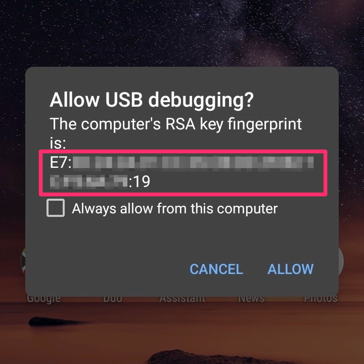

So you already managed to [enable the developer options](https://developer.android.com/studio/debug/dev-options.html ) on your Android device and also [enabled USB-Debugging](https://developer.android.com/studio/debug/dev-options.html#debugging).

If you connect your device to the computer while Android Studio is running, a dialog box appears on the device to confirm the computer's RSA key fingerprint.



But what ist this RSA key fingerprint? And how can you check - for security reasons - if it really is the expected one?

Android Studio (respectively adb) generates an RSA key in your  `~/.android` folder.
The *RSA Fingerprint* is just the md5 of the public key part.

## Print the computer's RSA Fingerprint
Start the terminal of your computer and run the following command
```bash
adb pubkey ~/.android/adbkey | awk '{print $1}' \
| openssl base64 -A -a -d | openssl md5 -c | tr a-z A-Z
```

You will get a md5 string like the following
```
E7:2C:F3:B5:CF:5A:47:E9:12:F2:96:3F:A1:16:1B:19
````

That's it. Compare this with the one in the dialog on your device - both should match.

{: .notice--warning}

**Note:** You will see a different md5 in the dialog on your device if you are using [Google Chrome Remote Debugging]( https://developer.chrome.com/docs/devtools/remote-debugging/) (parallel to Android Studio). Remote Debugging with `chrome://inspect#devices` in your Chrome browser does not use the adbkey. This is beyond the scope of this post. Find some [further details on Stack Overflow](https://stackoverflow.com/questions/61591205/physical-devices-not-working-in-android-studio-multiple-rsa-key-fingerprints-bu).

## Details for the curious

The one-liner may need some explaination. You might have noticed that the  `~/.android` folder only contains the private key named  `adbkey`.

1. The first part just generates the required pubkey from that private key
   ```
   adb pubkey ~/.android/adbkey
   ```

2. The output contains the public key and some more information in the format `<public-key> <User>@<computer-name>`. We only need the plain public-key-part. That's what we get with the use of `awk`:
   ```bash
   awk '{print $1}'
   ```

3. The result is a base64 encoded value that is decoded with openssl:
   ```bash
   openssl base64 -A -a -d
   ```

4. The md5 of that result is the fingerprint we’d like to compare:
   ```bash
   openssl md5 -c
   ```
   The Parameter `c` gives us the md5 with the separating colons.

5. The `tr a-z A-Z` just transforms the lowercase letters into uppercase so its the same format and easier to compare with what you see on the device.

