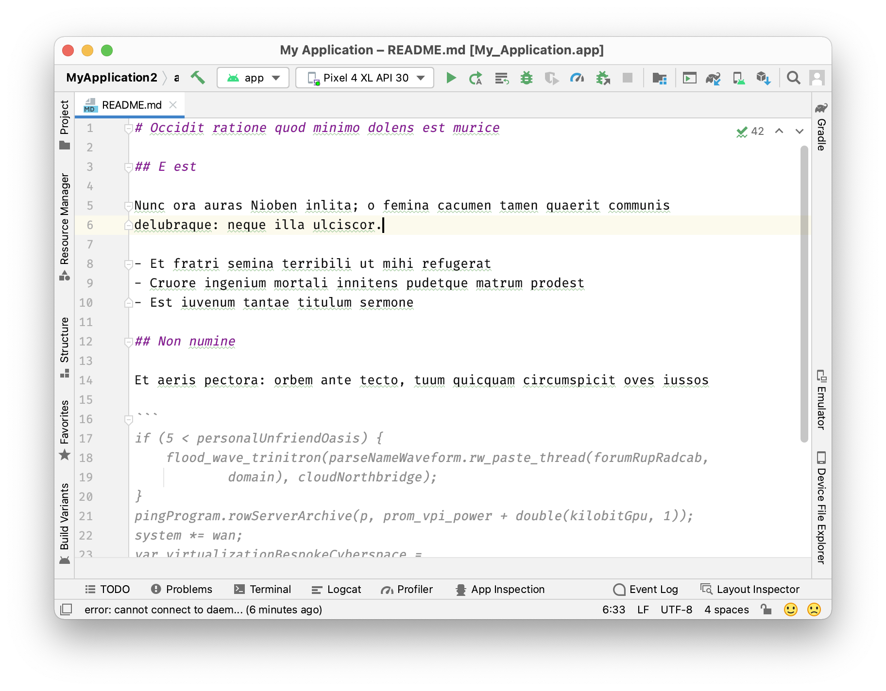
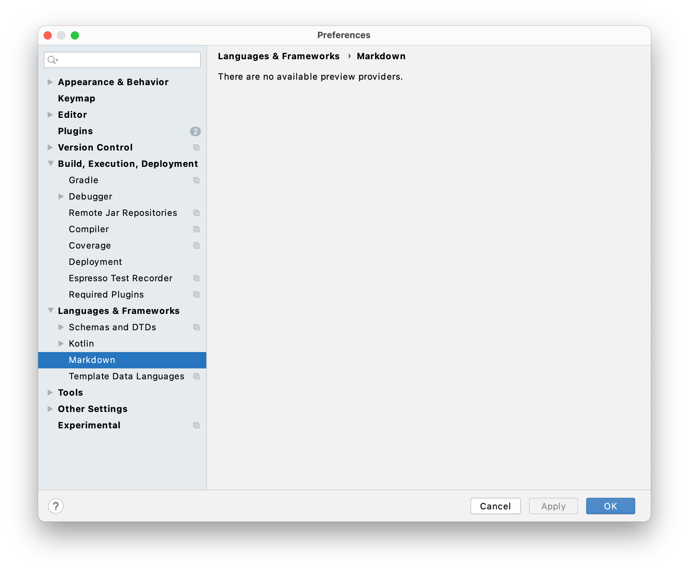
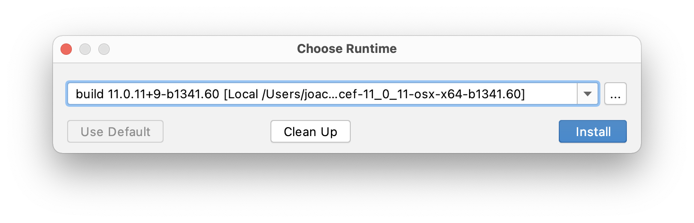
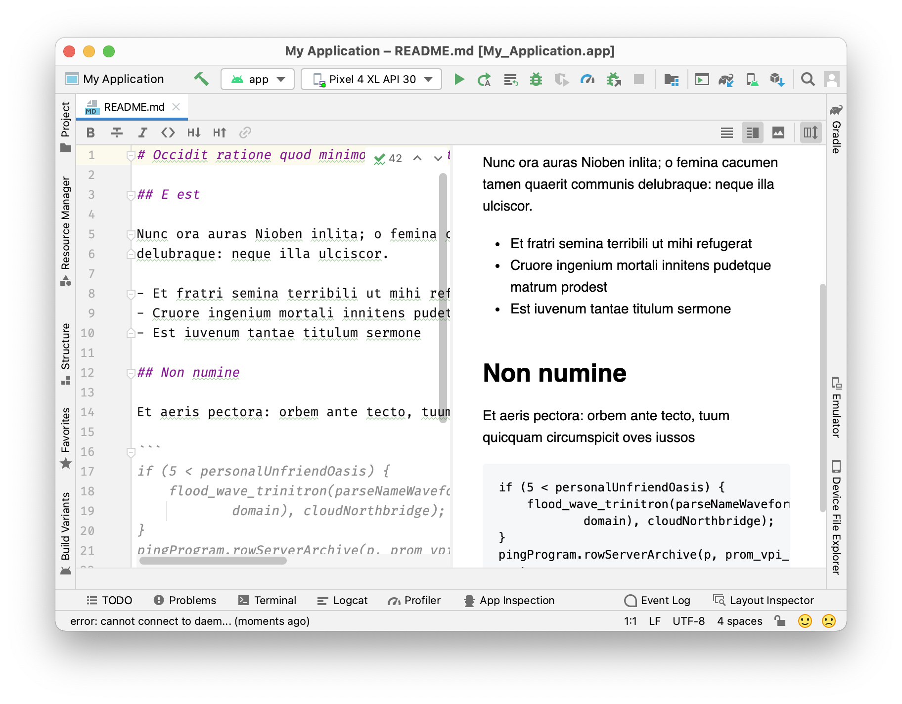
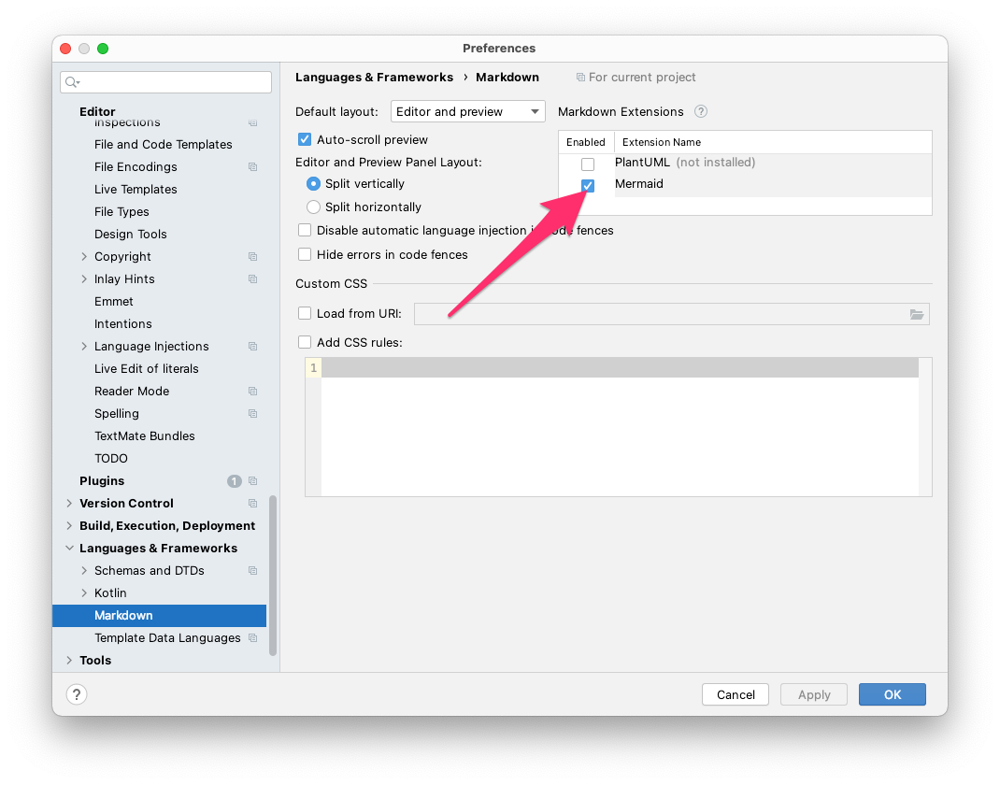
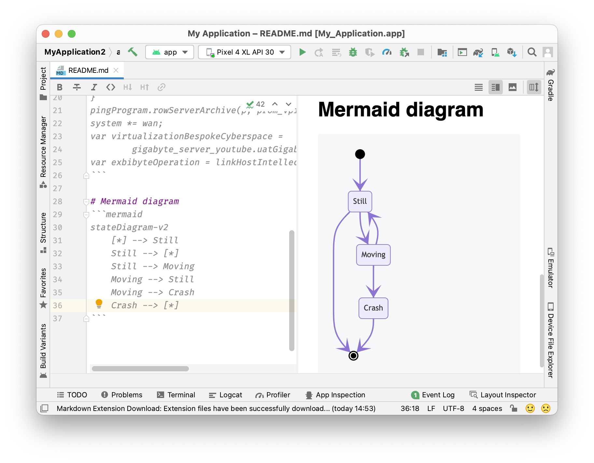

When editing a Markdown file, Android Studio suggests installing the [Markdown Plugin](https://plugins.jetbrains.com/plugin/7793-markdown). The [IntelliJ IDEA 2020.3 Doku](https://www.jetbrains.com/help/idea/2020.3/markdown.html)  (Android Studio Arctic Fox 2020.3.1 is based on that version)  shows some nice shortcuts and screenshots.

But after installing the Plugin you will see the editor with some nice coloring but no extra toolbar and no preview pane.



Also the Markdown preferences only show an error message.



Some research shows that the [Markdown plugin does not work](https://youtrack.jetbrains.com/issue/IDEA-255361) properly as of Android Studio 4.1.

A comment on a [more recent jetbrains issue](https://youtrack.jetbrains.com/issue/IDEA-269353) notes that it is not an IntelliJ issue, but an [Android Studio issue](https://issuetracker.google.com/issues/159933628) that is still not fixed. Also, a commenter in this issue mentions that JetBrains changed the [plugin dependencies](https://blog.jetbrains.com/platform/2020/07/javafx-and-jcef-in-the-intellij-platform/) to require JCEF - [Java Chromium Embedded Framework](https://plugins.jetbrains.com/docs/intellij/jcef.html) - which is pre-bundled in the JDK (aka JBR - [JetBrains Runtime](https://confluence.jetbrains.com/display/JBR/JetBrains+Runtime)) with IntelliJ IDEA versions starting in 2020.2.

So the solution would be for Google to bundle Android Studio with a JBR that integrates JCEF.

Fortunately, the JBR can be changed and JetBrains makes the JBRs available for download. JetBrains even provides a [Guide to change JBR](https://intellij-support.jetbrains.com/hc/en-us/articles/206544879-Selecting-the-JDK-version-the-IDE-will-run-under), but it does not fit well with Android Studio Arctic Fox.

## Change JBR in Android Studio to fix Markdown plugin

So here are the steps to change the JBR in Android Studio:

- Download a [current JBR](https://confluence.jetbrains.com/display/JBR/Release+notes+and+builds) (e.g. Version [11.0.11+9-b1341.60](https://confluence.jetbrains.com/pages/viewpage.action?pageId=218857477))

- Extract the Content to `~/Library/Java/JetBrainsRuntime`
  ```bash
  file=jbr_jcef-11_0_11-osx-x64-b1341.60.tar.gz
  dir=~/Library/Java/JetBrainsRuntime/${file%.tar.gz}
  mkdir -p $dir
  tar -xzf $file -C $dir --strip-components=1
  ```

- In Android Studio open `Preferences...` > `Plugins` and install the plugin "Choose Runtime" (no restart required)

- open menu `Help` > `Find Action...` (`shift` + `cmd` + `A`) and search for "Choose Runtime..." and execute

- In the dialog press `...` and select the folder you extracted the JBR to (in case of the folder *~/Library/Java/...* it might be easier to open it in the Finder and drag and drop it into the dialog)
  
  
- Install it - Android Studio will restart


After restarting Android Studio, the Markdown plugin will be fully functional.



## Bonus - Mermaid diagrams

Enable Mermaid in the Markdown Preferences to support [Mermaid diagrams](https://mermaid-js.github.io/) in your Markdown documents.
If you haven't heard of Mermaid yet, take a look at the [examples](https://mermaid-js.github.io/mermaid/#/examples) to get an idea of what is possible with Mermaid.

To enable the rendering of Mermaid diagrams, open `Preferences...` > `Languages & Frameworks` > `Markdown` and set the checkbox at *Mermaid*.



Using a code bock with Mermaid syntax will be rendered in the preview pane.


