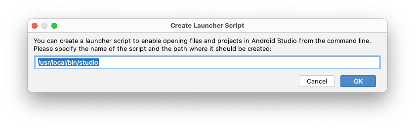
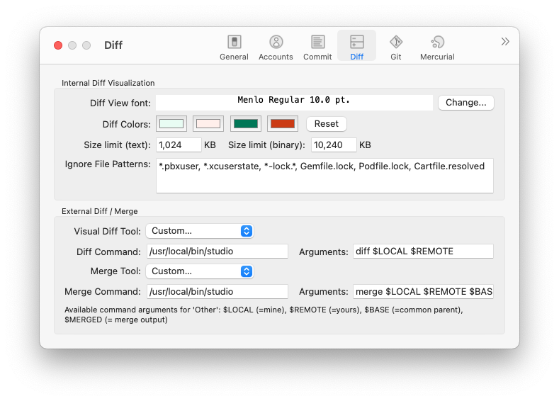
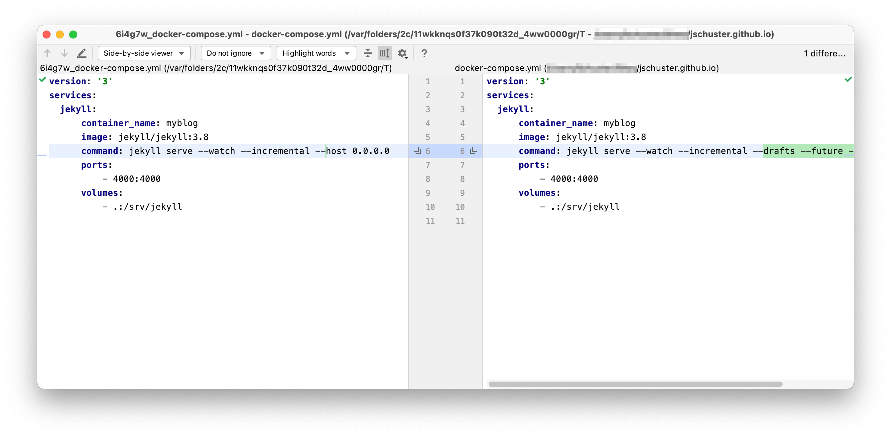

{: .notice}
**Update 2024-02-15:**  With Hedgehog, the installation process described in the section [Install command line launcher](#install-command-line-launcher) has changed. I have created a [new blog post]({{ site.baseurl }}) on how to start Android Studio via the command line from now on.

Android Studio (resp. [IntelliJ IDEA]( https://www.jetbrains.com/help/idea/command-line-differences-viewer.html)) provides a very good diff and merge tool. Android Studio can also be integrated into the terminal.

This makes it ideal for integration into other tools like Git clients. I prefer Sourcetree, but that's just a matter of taste and probably just a matter of getting used to it over the years.

So integrating Android Studio with Sourcetree as a diff and merge tool only requires the `studio` launcher script.

## Install command line launcher

In Android Studio open menu **Tools** > **Create Command Line Launcher…** and confirm the installation to the default location with **OK**.




This creates a script named `studio` in `/usr/local/bin` which should by default be in the `PATH` variable. So you can use it from any path in your terminal.

{: .notice--warning}
**Note:** If you have multiple Android Studio versions installed, keep in mind that the script will reference the instance you created the script from.   
So, if you want to change Android Studio to a different location, you may need to recreate the script, which replaces the existing script with the new one.

## Configure Sourcetree

The Android Studio command line tool `studio` brings the parameters `diff` and `merge`.

So for example you can compare two files by

```bash
studio diff first.txt second.txt
```

Integration with SauceTree is now simply setting the **External Visual Diff Tool** to **Custom…**  and **Diff Command** to `/usr/local/bin/studio`.
The **Arguments** must be set to

```bash
diff $LOCAL $REMOTE
```

The same applies to the **Merge Tool**, but with the **Arguments**:

```bash
merge $LOCAL $REMOTE $BASE $MERGED
```

The Result should look like this




Now select a modified file in SauceTree and apply **External Diff** to it. Android Studio opens a extra diff window like this:



Also in case of a merge conflict, you can use **Resolve Conflicts** > **Start External Merge Tool** to bring up a merge window where you can systematically resolve the conflictl.

## Configure Git command line
Have a look at your gitconfig - you may want to use your new studio command line launcher to edit the file  😉
```
studio ~/.gitconfig
```
If you configured Sourcetree beforehand you will see, the Sourcetree configuration is embedded directly into your `.gitconfig` among other configurations.

```bash
...
[difftool "sourcetree"]
    cmd = /usr/local/bin/studio diff $LOCAL $REMOTE
    path = 
[mergetool "sourcetree"]
    cmd = /usr/local/bin/studio merge $LOCAL $REMOTE $BASE $MERGED
    trustExitCode = true
...
```

{: .notice--info}
**Info:** If you have [configured SauceTree](#configure-saucetree) you should not modify the name behind `difftool` and `mergetool`  - Sourcetree will lose it's connection and will create new entries in the file.  
If you have not and do not want to, you can copy the snippet and replace the name "saucetree" with any other.

Add the following line to use the `difftool` configuration from above also for the command line.

```
[diff]
    tool = sourcetree
```

Now you can compare the changes of the modified file `foo.txt` with

```
git difftool foo.txt
```

If you want to skip the `Launch 'sourcetree' [Y/n]?` every time you use `git difftool` add this lines to your `.gitconfig`

```
[difftool]
    prompt = false
```

For the configuration as merge tool add the following lines
```
[merge]
    tool = sourcetree
```

You can find more configurations [in the Git community documentation](https://git-scm.com/book/sv/v2/Customizing-Git-Git-Configuration).

<div class="notice--info" markdown="1">
**Info:** You might run into the same question I did,  
what is the difference between `git diff` is different to `git difftool`?

[This answer](https://stackoverflow.com/a/20951002/362182) to that question on Stack Overflow brings it to the point:

> `git difftool` will use an external tool, while `git diff` will show the diff directly in the terminal.

There are also ways to set a GUI diff tool for `git diff`. But you might need a terminal diff at some point, so I would keep that for this purpose.
</div>
