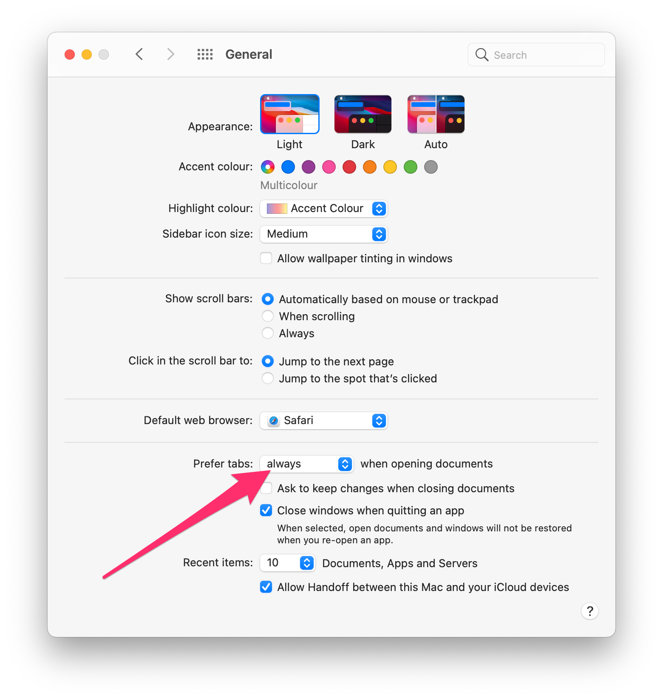

Those who have learned to love working with tabs instead of individual windows in Safari, for example, may want to use this in other apps as well. Finder and many other Mac apps support tabs, some better, some worse. Since macOS Mojave 10.14 at the latest, the behavior of all apps can be set in the [General System Preferences](https://support.apple.com/en-nz/guide/mac-help/mchla4695cce). Here you can specify when macOS should "convince" an app to first use tabs instead of windows.

# Prefer tabs always

Go to **Apple menu**  > **System Preferences**, then click **General** and set **Prefer tabs:** option to **always**. 



From now on, all applications that support this will open tabs instead of new windows.

This way you can even teach Android Studio (or IntelliJ) to display all project windows in tabs (there is no menu entry or shortcut for this yet).

SourceTree can also be made to start with all tabs from the previous session in this way - otherwise [SourceTree always forgets](https://community.atlassian.com/t5/Sourcetree-questions/How-to-Start-SourceTree-for-Mac-with-Tabbed-Windows/qaq-p/627191) whether the windows are currently collected and displayed in tabs when exiting and restarting.

# A little more refinement

For all the advantages that tabs bring, the above method is somewhat overarching. Not every application behaves as usual or as you would like it to with this setting. For example, the shortcut <kbd>⌘ Cmd</kbd> + <kbd>N</kbd> or the menu item **New Window** in Safari or Finder will open a tab in an existing window. So you can only create a new window by dragging out the newly created tab.

Fortunately, many things can still be set in macOS via the command line tool 'defaults'. And also for the tab handling, you can specify the behavior for individual apps.

For example, you can set the tabbing mode to `always` only for Android Studio:

```
defaults write -app "Android Studio" AppleWindowTabbingMode -string "always"
```

The values `manual`, `fullscreen` and `always` are available (by the way, `manual` corresponds to *never* in the System Preferences).

If you want to read the setting for a specific app, you can do that with

```
defaults read -app "Android Studio" AppleWindowTabbingMode
```

If you have not set a value explicitly for this app, you will get a corresponding message

```
The domain/default pair of (com.google.android.studio, AppleWindowTabbingMode) does not exist
```

If a value is set, it is output

```
always
```

You can also use the following line to reset the special TabbingMode for an app

```
defaults delete -app "Android Studio" AppleWindowTabbingMode
```

You can now set the behavior for all apps individually. Of course, you can also use it the other way around and set all apps to **always** in the System Preferences and exclude individual apps by setting **manual** via command line.

<div class="notice--info" markdown="1">
**Note:** For Finder it needs a slightly different usage - here the bundle identifier has to be used instead of the app name.
```
defaults write com.apple.finder AppleWindowTabbingMode -string "manual"
```
</div>
