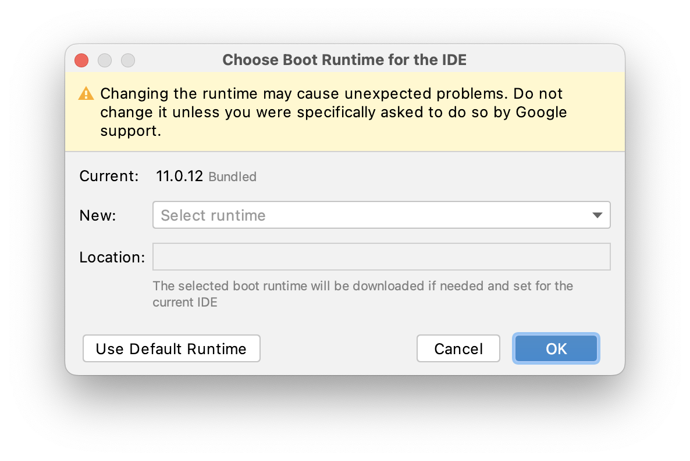
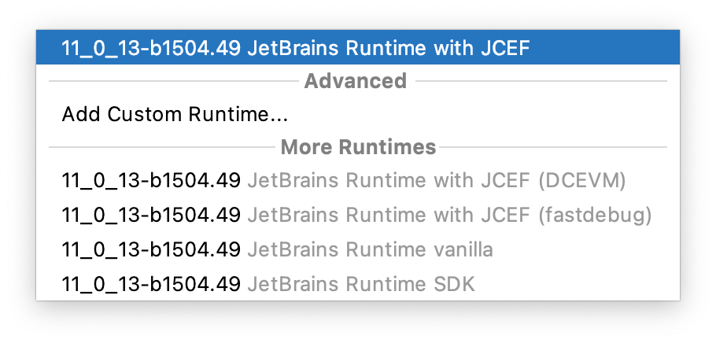
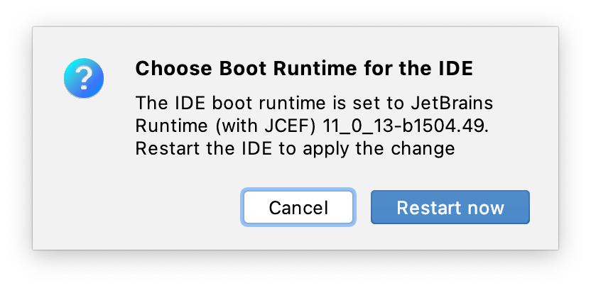

The good old [Markdown Plugin](https://plugins.jetbrains.com/plugin/7793-markdown) stopped working in Android Studio Chipmunk again.

For more details on why, see my old post [Fix Markdown Plugin in Android Studio Arctic Fox 2020.3.1 ]({{ site.baseurl }}). In short, the embedded JBR does not integrate JCEF ([Java Chromium Embedded Framework](https://plugins.jetbrains.com/docs/intellij/jcef.html)).

But the good news is that Chipmunk has made it even easier to change the JBR.

## Change JBR in Android Studio to fix Markdown plugin

So here are the steps to change the JBR in Android Studio Chipmunk:

- open menu **Help** > **Find Action...** (<kbd>⇧ Shift</kbd> + <kbd>⌘ Cmd</kbd> + <kbd>A</kbd>) and search for "Choose Boot Java Runtime for the IDE..." and execute
- In the dialog open the drop down **Select runtime**
  
- Take the default selection or choose from the **More Runtimes** one with JCEF in its title. Confirm with OK.
  
- After download and install you have to apply the changes with **Restart now**
  

Done. Now you can enjoy the full Markdown experience again.