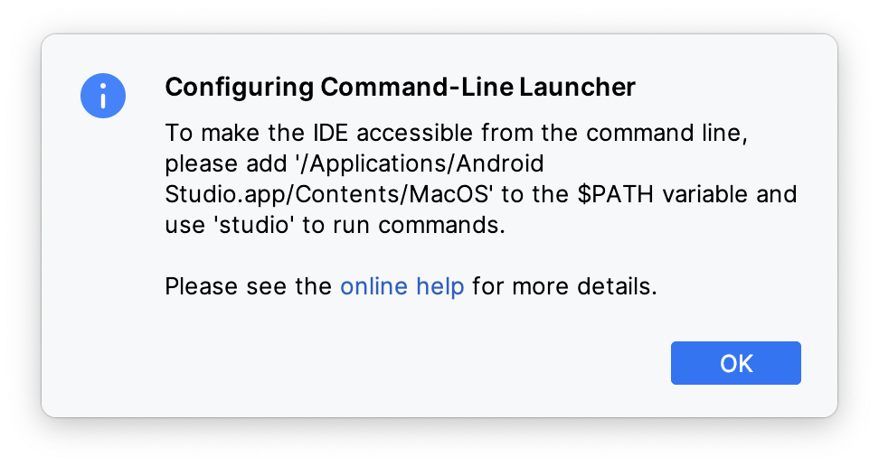

With Android Studio Hedgehog, my now outdated blog post [Android Studio as a standard diff and merge tool]({{ site.baseurl }}) on the same topic unfortunately no longer works.

So here is a little update on how to use Android Studio (or IntelliJ IDEA) as a diff tool for e.g. Sourcetree.

## Create command line launcher

In earlier Android Studio versions, you could create a command line launcher via the menu **Tools** > **Create Command Line Launcher…** and confirm the installation to the default location with **OK**.

Nowadays, you get the information that you have to create it yourself:



The suggested way to add  `'/Applications/Android Studio.app/Contents/MacOS' `to the `$PATH` variable made the command `studio` available to the terminal. But Sourcetree does not seem to read the `$PATH` varialbe and thus did not work with setting `studio` as the Diff command.

What worked, however, was to set the entire path to the `studio` binary so `'/Applications/Android Studio.app/Contents/MacOS/studio'` (note: enclosed in `'` because of the space in the app name) as a diff command.

## The better way: create a studio script in /usr/local/bin/

The [online help](https://www.jetbrains.com/help/idea/working-with-the-ide-features-from-command-line.html#69da8ca7) mentioned in this dialog suggests creating the start script yourself. However, some details are missing in this suggested solution.

The easiest and best way I have found is to create a script file named `studio` in `/usr/local/bin/` (or somewhere else and create a symbolic link to it) and make it executable as described in the online help. 

Almost identical, but with the following content:

```bash
#!/bin/sh

open -W -nb "com.google.android.studio" --args "$@";
```

{: .notice--info}
**Info:** The essential part is the `-W` parameter - otherwise Android Studio will start and complain that it could not find the files to compare.<br>
Instead of the `-a` parameter from the [online help](https://www.jetbrains.com/help/idea/working-with-the-ide-features-from-command-line.html#69da8ca7), I prefer the `-b` parameter, which uses the BundleIdentifier instead of the application name to find the application to open, which is more reliable in my opinion.

With this studio script the configuration is exaclty like in the old days [Android Studio as your standard diff and merge tool]({{ site.baseurl }}#configure-sourcetree).


