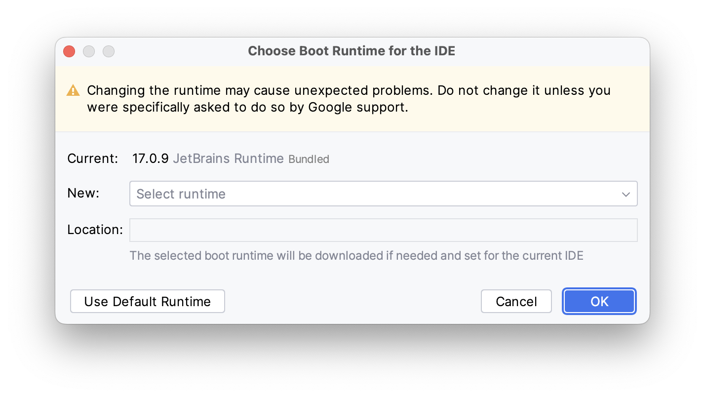
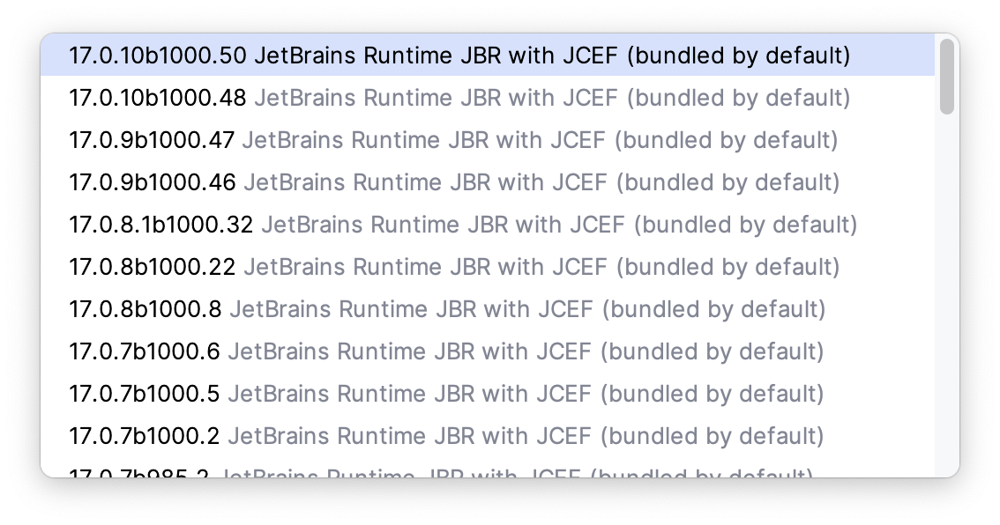
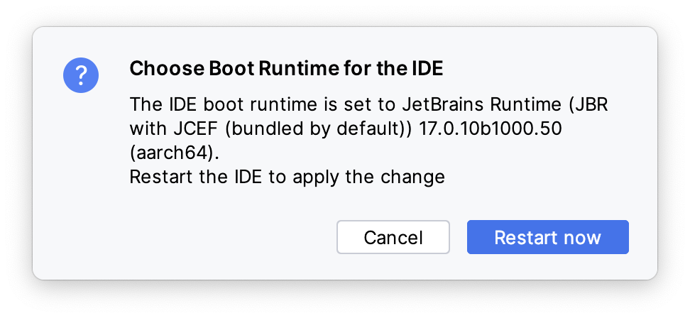
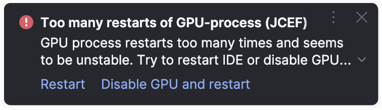
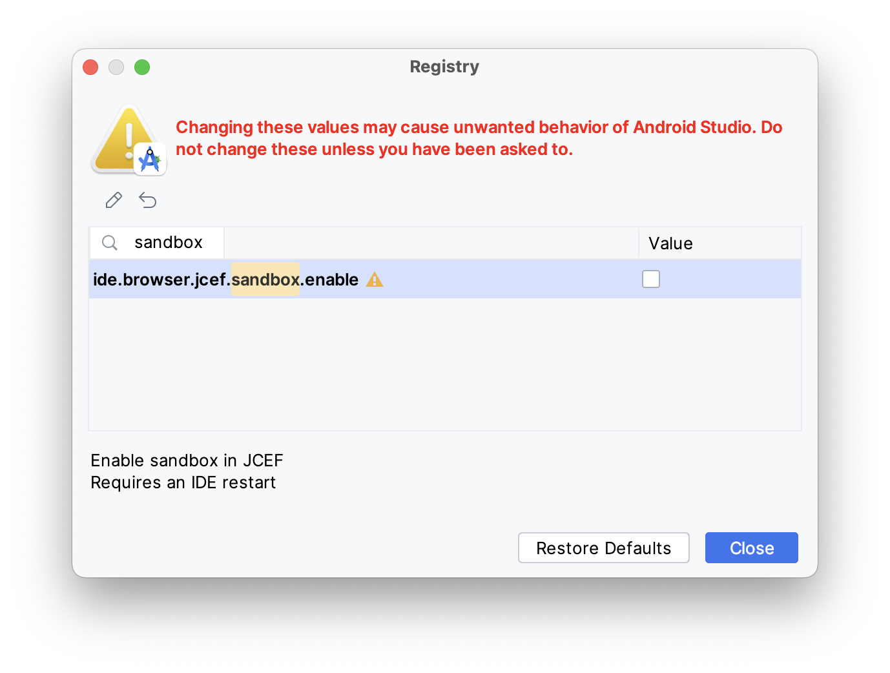

Android Studio has been having problems with the [Markdown Plugin](https://plugins.jetbrains.com/plugin/7793-markdown) for some time now.

It started with  [Arctic Fox 2020.3.1]({{ site.baseurl }})., continued with [Chipmunk 2021.2.1]({{ site.baseurl }}) and has since continued with at least Giraffe, Hedgehog and now Iguana too.
Since this [doesn't seem to be fixed in upcoming releases](https://issuetracker.google.com/issues/159933628), here is a guide that I will continue to maintain.

## Change JBR in Android Studio to fix Markdown plugin

{: .notice--info}
**Info:** Since Giraffe at the latest, you must also adjust a so-called [registry entry](#registry---disable-idebrowserjcefsandboxenable). You have to reboot for this to take effect. So if you set it before selecting the boot runtime, you only have to reboot once.

The Markdown plugin requires a JBR (JetBrains Runtime) that integrates JCEF. For some reason, Google bundles Android Studio by default with a JBR without JCEF. But you can change it.

### Choose Boot Java Runtime

- open menu **Help** > **Find Action...** (<kbd>⇧ Shift</kbd> + <kbd>⌘ Cmd</kbd> + <kbd>A</kbd>) and search for "Choose Boot Java Runtime for the IDE..." and execute
- In the dialog open the drop down **Select runtime**
  
- Take the default selection or choose from one with JCEF in its title. Confirm with OK.
  
- After download and install you have to apply the changes with **Restart now**
  

Done. Now you can enjoy the full Markdown experience again.

### Registry - disable ide.browser.jcef.sandbox.enable

It is very likely that you will receive the following message after restarting Android Studio (at least that was the case for me with Giraffe, Hedgehog and Iguana):

 

To fix this:

- open menu **Help** > **Find Action...** (<kbd>⇧ Shift</kbd> + <kbd>⌘ Cmd</kbd> + <kbd>A</kbd>) and search for "Registry..." and execute 

- find the key `ide.browser.jcef.sandbox.enable` by typing the first letters or srcoll down in the list
- disable this key
  
- Close the Registry Editor
- Restart Android Studio (or if you read this manual carefully, set the Registry before [Choose Boot Java Runtime](#choose-boot-java-runtime) to restart only once😉)
